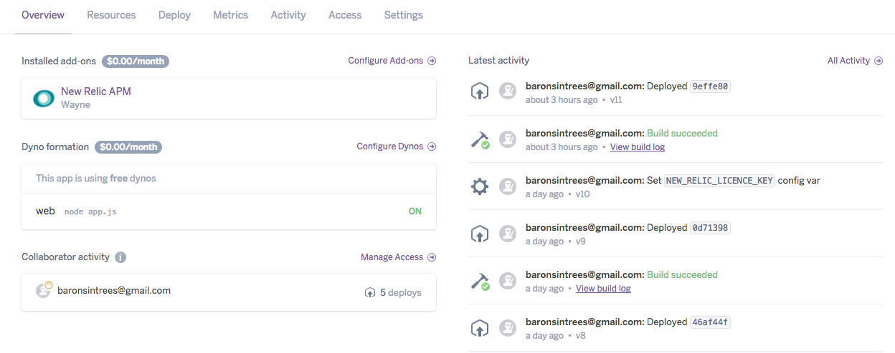
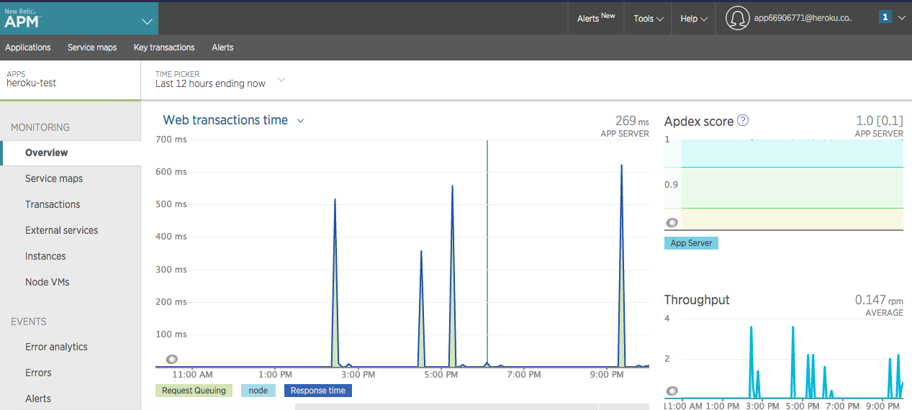

# heroku-test

##### _A Node.js app using [Express 4](http://expressjs.com/): April 18th, 2017_

##### By _**Kyle Lange**_

### _[See it live](https://powerful-wave-18447.herokuapp.com/cool) on heroku:_

Hat Tip: This app uses code from the [heroku tutorial](https://devcenter.heroku.com/articles/getting-started-with-nodejs#introduction) on deploying an app with Node.js and using the New Relic add-on






## Learnings

* how to set up/login to heroku through the Terminal
* How to install the heroku CLI
* how to deploy and open the app
* how to view terminal logs
* modify/create the procfile
* how to set up the New Relic [Add-on](https://docs.newrelic.com/docs/agents/nodejs-agent/hosting-services/nodejs-agent-heroku)


## Setup/Installation Requirements

1. Download this repo using your terminal:

Make sure you have [Node.js](http://nodejs.org/) and the [Heroku CLI](https://cli.heroku.com/) installed.

```sh
git clone https://github.com/kylelange/heroku-test

cd heroku-test

npm install

npm start
```
Your app should now be running on [localhost:5000](http://localhost:5000/) OR _[See it live](https://powerful-wave-18447.herokuapp.com/cool) on heroku._

View the code by drag-and-dropping the file into your [favorite text editor](https://atom.io)

## Known Bugs

_There are no known bugs as of the last commit. Please send an ISSUE on github in the repository if you see something I have not._

## Support and contact details

For questions or comments, please __email  [Kyle here.](baronsintrees@gmail.com)__

## Technologies Used

* Express.js
* Git + the Terminal
* Heroku/New Relic Documentation

## Documentation

For more about using Node.js on Heroku, see these Dev Center articles provided by heroku:

- [Getting Started with Node.js on Heroku](https://devcenter.heroku.com/articles/getting-started-with-nodejs)
- [Heroku Node.js Support](https://devcenter.heroku.com/articles/nodejs-support)
- [Node.js on Heroku](https://devcenter.heroku.com/categories/nodejs)
- [Best Practices for Node.js Development](https://devcenter.heroku.com/articles/node-best-practices)
- [Using WebSockets on Heroku with Node.js](https://devcenter.heroku.com/articles/node-websockets)
